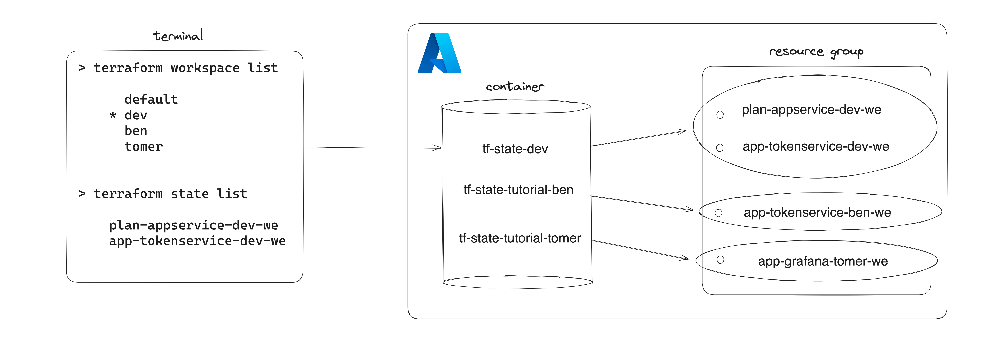

# Terraform for Team Microservices

Terraform is an open-source Infrastructure as Code (IaC) tool that allows you to define and provision cloud infrastructure using a declarative configuration language. In this tutorial, we'll cover some Terraform basics and explore how to create and manage infrastructure within our team (TMS). We conclude this tutorial with an explanation of the current Terraform setup and how we deploy resources to Azure within the CI/CD pipeline. We also cover how to development new Terraform code for Team Microservices.

## Table of Contents
1. [Installation](#1-installation)
2. [Terraform Project Elements](#2-terraform-project-elements)
3. [Terraform Commands](#3-terraform-commands)
4. [Exercise: Create an App using a Terraform Workspace](#4-exercise-create-an-app-using-a-terraform-workspace)
5. [Terraform Setup for Team Microservices](#5-terraform-setup-for-team-microservices)

# 1. Installation

Ensure you have Terraform installed on your machine by downloading the latest version from the official [HashiCorp website](https://developer.hashicorp.com/terraform/tutorials/aws-get-started/install-cli). Follow the installation instructions for your operating system.

Additionally, for later steps in this tutorial, you'll need to deploy resources to Azure with Terraform. Therefore, make sure you have an Azure account with the proper contribution rights and install the Azure CLI by following the instructions [here](https://learn.microsoft.com/en-us/cli/azure/install-azure-cli).

Verify the successful installations of Terraform and Azure CLI by checking the versions:

```bash
terraform --version
az --version
```

After successfully installing the Azure CLI, enable it by logging in:

```bash
az login
```

# 2. Terraform Project Elements
Terraform projects consist of various configuration files defining and managing infrastructure resources. These files need to be stored in a single folder. When running Terraform commands, Terraform will load the files present in the folder without recursively going into subfolders or parent folders. Important files include:

- `main.tf`: Primary configuration file containing infrastructure resource definitions and other necessary configurations.
- `variables.tf`: Contains variable definitions to be used in configuration files.
- `vars.tfvars`: Contains key-value pairs used as environment variables, matching the defined variables in variables.tf.
- `provider.tf`: When using a remote backend (e.g., AWS S3, Azure Storage), this file defines the backend configuration.
- `terraform.tfstate`: Contains the current state of infrastructure, managed by Terraform, stored locally by default.

## Coding Terraform
Terraform utilizes the HashiCorp Configuration Language (HCL) to declaratively define and provision infrastructure as code. HCL's human-readable syntax resembles a JSON format.

### Resouce and Data blocks

In Terraform, a resource block is used to create and manage a specific infrastructure component, such as a virtual machine or a database. It typically includes parameters like resource type, name, and configuration settings. Meanwhile, a data block is used to fetch information about already existing resources from the infrastructure.

Below is an example of how a data block is created to be used in a resource block in the file `main.tf`. By referencing the resource group through a data block, we can now access the location attribute of the resource group.

```python
# main.tf

# Reference to resource group with data block
data "azurerm_resource_group" "rg" {
  name = "rg-micorservices-dev-we"
}

# create app service plan with the resource block
resource "azurerm_service_plan" "sp" {
  name                = "plan-microservices-dev-we"
  resource_group_name = data.azurerm_resource_group.rg.name
  location            = data.azurerm_resource_group.rg.location # access location attribute
  os_type             = "Linux"
  sku_name            = "S1"
}
```

### variables.tf
The `variables.tf` file usually declares the variables that your Terraform configuration will use. These variables can be overwritten, acting as parameters that can be customized when applying the Terraform configuration, enabling you to reuse the same code for different environments. Variables can be defined as follows:

```python
# variables.tf

variable "rg" {
    description = "resource group name"
    type = string
}

variable "region" {
  description = "The region of the azure server"
  type        = string
  default     = "westeurope"
}

variable "team_members" {
  description = "Example list. Contains team member strings"
  type        = list(string)
  default     = ["wouter", "olgerik", "tomer", "tiddo"]
}
```

Often variables.tf is where the variables are declared. However, it is not necesasary that the file is calles variables.tf. You can declare variables anywhere in the Terraform configuration code. To refernce a variable in the terraform code use `var.region` or `some-string-${var.region}` if the variable must be included in a string.

### .tfvars
In Terraform, `.tfvars` files are used to provide specific values for the variables defined in your Terraform configuration. These files allow you to assign concrete values to variables, customizing the configuration without modifying the actual Terraform code.

```python
# dev.tfvars

rg       = "rg-microservices-dev-we"
region   = "westeurope"
```

You can apply the values from a `.tfvars` file using the `-var-file` option with `terraform plan` and `terraform apply`. For example

```bash
terraform plan -var-file=dev.tfvars
```

## Terraform State

Terraform relies on a state file to keep track of the current state of your infrastructure. This file, by default named `terraform.tfstate`, is crucial for Terraform to understand what resources are currently deployed and how they are configured. The state file maintains information about resource attributes, dependencies, and the relationship between different components of your infrastructure.

### Local State vs. Remote State

By default, Terraform stores the state file locally in the same directory as your configuration files. While this works well for solo projects, it is challenging in collaborative or multi-user environments. Infrastructure modifications can lead to conflicts, and sharing state files is not practical. By storing the state file remotely, multiple team members are able to use the same state file so that everyone is using the most up-to-date state version when making changes.

In the current Terraform setup for TMS, we would like to make use of the `azurerm` backend to store our infrastructure states in Azure Storage. Therefore, we can configure the `provider.tf` file as follows:

```python
# provider.tf

terraform {
  backend "azurerm" {
    storage_account_name = "<storage-account-name>"
    container_name       = "<container-name>"
    key                  = "<state_name>"
  }
}
```

> **_NOTE:_** We should create the storage account and container with Terraform first before we can use Azure as the backend. Then we configure `provider.tf` and apply the changes to migrate the state to the Azure container.

# 3. Terraform Commands

In this section of the tutorial, please follow the steps and execute the commands in your terminal.

In the current folder (`docs/terraform/tutorial`), we have already configured `provider.tf` to utilize the `azurerm` backend. We specified the storage account, storage container, and the state key. Check out `provider.tf`.

The `terraform init` command is used to initialize a Terraform directory. This command downloads the provider plugins and sets up the backend. You can run `terraform init` after navigating to the tutorial folder:


```bash
cd docs/terraform/tutorial
terraform init
```

Check the backend to verify if the state you just used for initialization is in our [container](https://portal.azure.com/#view/Microsoft_Azure_Storage/ContainerMenuBlade/~/overview/storageAccountId/%2Fsubscriptions%2F5c6f5c82-5121-4585-b7e1-1e5c11d31125%2FresourceGroups%2Frg-microservices-shd-we%2Fproviders%2FMicrosoft.Storage%2FstorageAccounts%2Fstmicroservicesshdwe/path/scmicroservicesshdwe/etag/%220x8DBE50508F01AD5%22/defaultEncryptionScope/%24account-encryption-key/denyEncryptionScopeOverride~/false/defaultId//publicAccessVal/None)

The `terraform plan` command is utilized to generate an execution plan, displaying the changes that Terraform will make to your infrastructure. This includes additions, modifications, and deletions. Currently, this command indicates that there are no changes. Give it a try:

```bash
terraform plan
```

The `terraform apply` command is used to apply the changes described in a Terraform execution plan. After running terraform plan and reviewing the changes. This command will ask for confirmation before making any changes. It's crucial to review the execution plan before applying it.

```bash
terraform apply
```

## Terraform Workspaces
Workspaces allow you to manage multiple environments using the same Terraform code. Common use cases include having separate workspaces for development, test, and production environments. Workspaces can also be used to develop and test Terraform code before merging it into the main branch. We also discuss the results for each command by also checking in on our backend in azure.

With the command `terraform workspace list` we can see the current workspaces associated with our folder. "default" is the default workspace and connot be deleted.

```bash
terraform workspace list
```

Now create a new workspace and for example name it '<your_name>'. After creating the new workspace, list the workspaces to see the result

```bash
terraform workspace new <your_name>

# list workspaces
terraform workspace list
```

If we run `terraform workspace list`, we see your newly created workspace. The "*" indicates which workspace is selected. With `terraform workspace select <workspace_name>`, we can switch between existing workspaces.

Each workspace has its own state. So when we created the new workspace, a new state file was added for that state. Please check out the [container](https://portal.azure.com/#view/Microsoft_Azure_Storage/ContainerMenuBlade/~/overview/storageAccountId/%2Fsubscriptions%2F5c6f5c82-5121-4585-b7e1-1e5c11d31125%2FresourceGroups%2Frg-microservices-shd-we%2Fproviders%2FMicrosoft.Storage%2FstorageAccounts%2Fstmicroservicesshdwe/path/scmicroservicesshdwe/etag/%220x8DBE50508F01AD5%22/defaultEncryptionScope/%24account-encryption-key/denyEncryptionScopeOverride~/false/defaultId//publicAccessVal/None) and see if there is a new state associated with your `<your_name>` workspace in the `terraform/tutorial` folder. When working in a team, we can each work in our own workspace to develop infrastructure. We can create resources as long as we do not give our resources the same name. If a resource with the same name already exists, `terraform apply` won't work, so you have to pick a different name for your resource.

After creating the new workspace, we can see what resources are currently in the state by running:
```bash
terraform state list
```

If you want to create a new workspace based on a existing state, its possible to pull the state and create a new workspace that inherits the pulled state. The commands are:

```bash
terraform state pull > pulled.tfstate
terraform workspace new -state=pulled.tfstate <your_name>
```
> **_NOTE:_** The inherited resources in your state can now be changed and deleted from within your new workspace and state.

# 4. Exercise: Create an App using a Terraform Workspace
The first task is to create an app in Azure using your workspace. In the second task, practice Terraform commands and explore the state file. Finally, in the last task, destroy the web app and the workspace created in the initial step.

The image below illustrates that each workspace is associated with a Terraform state file in the Azure container. Each state "points" to its created resources, allowing us to destroy specific resources without affecting other infrastructure. A similiar setup you will create (together) in the follwing exercises. 

> **_NOTE:_** The `dev` workspace is shown in the figure as an example, but does not exist in this tutorial Terraform configuration.

1. In `main.tf` in this folder, a basic Terraform setup is provided. It includes data blocks to import resources and create a new web app service. Uncomment and customize the code to deploy the web app. The variable `terraform.workspace` provides the workspace name. Ensure you select your created workspace. 
<details>
<summary>Hint: Terraform Commands Ex. 1</summary>

```bash
terraform workspace select <your_name>
terraform plan
terraform apply
```
</details>
<br/>

2. Modify the web app code in `main.tf` to use variables from `variables.tf`. Set values in `vars/trl.tfvars`.
<details>
<summary>Hint: Terraform Commands Ex. 2</summary>
    
```bash
terraform plan -var-file=vars/trl.tfvars
terraform apply -var-file=vars/trl.tfvars
```
</details>
<br/>

3. After creating the web app, inspect the state of your workspace. 
<details>
<summary>Hint: Terraform Commands Ex. 3</summary>

```bash
terraform state list
```
</details>
<br/>

4. Destroy the entire Terraform configuration, then examine your workspace state. If empty, delete your workspace.
<details>
<summary>Hint: Terraform Commands Ex. 4</summary>

```bash
terraform destroy -var-file=vars/trl.tfvars
terraform state list
# switch to default workspace as you cannot delete the workspace you are currently in
terraform workspace select default
terraform workspace delete <you_name>
terraform workspace list
```
</details>
<br/>



To conclude the Terraform workspace tutorial, here are some key take aways:

- Terraform workspaces create isolated environments within a single configuration.
- Each workspace has its own associated state.
- In a workspace you can reference existing elements to build new infrastructure.
- Workspaces are bound to a folder and its backend.
- Workspaces are **not** bound to a specific resource group.

# 5. Terraform Setup for Team Microservices
In this chapter, the current setup for creating and managing infrastructure with Terraform is discussed. In the folder `infrastructure/`, the Terraform code is maintained. We made a separation between the resources belonging to the shared environment and resources belonging to the app environments. The shared resources are created in the `shared` folder, and these resources may be utilized across the different app environments. The resources that specifically belong to the development, test, and production environments are created in the `app_envs` folder. In the `sketch` folder new Terraform code can be developed and tested before implenting it in the `app_envs` configuration.

## Terraform Workspaces
For each environment, we created a Terraform workspace matching the environment's abbreviated name. This results in the Terraform workspace `shd` in the `shared` folder. In the `app_envs` folder, we created three Terraform workspaces: `dev`, `tst`, and `prd`. These Terraform workspaces each manages infrastructure in its designated environment only.

## Terraform Deployments
For the `app_envs` folder, we aim to centralize the infrastructure configuration by utilizing Terraform workspaces. This approach involves adjusting specific variables to minimize differences in deployments across development, testing, and production environments.

To deploy to each environment, including the shared environment, we have designed a Terraform deployment job to deploy infrastructure from the CI/CD pipeline in Azure. The Terraform deployment job includes the following steps and takes the workspace name and the Terraform state path as inputs:

1. Retrieve the current state and initialize the folder, running terraform init.
2. Select the Terraform workspace with `terraform select <workspace_name>`.
3. Create a Terraform plan with `terraform plan -out main.tfplan -var-file=vars/<workspace_name>.tfvars`.
4. Create the infrastructure by applying the plan: terraform apply main.tfplan.

The deployment to each environment is illustrated in the image below. For each folder, the selected workspace is indicated by the "*" sign. The .tfvars file matching the workspace name is used for deploying infrastructure to each environment.
> **_NOTE:_** We don't deploy any configuration from the `sketch` folder in the CI/CD pipeline. We only use this folder te explore and develop Terraform code.


## Infrastructure Development Workflow

For the purpose of development, testing, and exploring new infrastructure, the `infrastructure/sketch` folder has been created. Within this folder, a `provider.tf` file is created to store the states of workspaces in the Azure container located in `terraform/sketch`. Before starting developing Terraform code in the `sketch` folder, it is crucial to follow the steps as described in the tutorial, explaining the use of Terraform workspaces. Please refer to the steps in the chapter [Terraform Commands](#3-terraform-commands) and complete the [Exercise](#4-exercise-create-an-app-using-a-terraform-workspace) to understand the practical application of workspaces. The following steps describe the process of developing Terraform code in the `sketch` folder and subsequently implementing it in the `app_envs` folder.

1. Navigate to the `infrastructure/sketch` folder, execute `terraform init`, and create a workspace. Switch to this workspace before commencing the development of new Terraform code.
2. Establish references to existing infrastructure if necessary and incorporate them into your new resources.
3. Utilize the `terraform.workspace` variable in your resource naming to explicitly indicate that the resource is created within a specific workspace.
4. Create new resources exclusively in the development resource group (`rg-microservices-dev-we`).
5. Upon completion of development, integrate the new infrastructure into the `app_envs` folder.
6. Switch to the `dev` workspace in the `app_envs` folder and execute `terraform plan -var-file=vars/dev.tfvars` to validate the plan.
7. If the plan aligns with expectations, merge your code into the main branch and allow the pipeline to deploy the infrastructure to the development, test, and production resource groups.
8. Please clean up the `sketch` environment and do not merge code from the `sketch` folder into main.
9. Delete your Terraform workspace in the `sketch` folder if no longer needed
